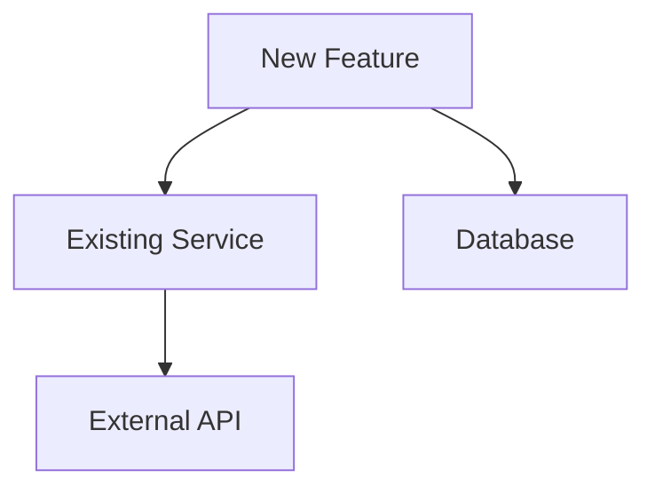

# Comprehensive Plan Template

Use this template for large features, architecture changes, migrations, or any high-risk implementation.

---

## [Project/Feature Name]

**Date:** [YYYY-MM-DD]
**Author:** [Name/AI]
**Status:** Draft | In Review | Approved | In Progress | Complete

---

## 1. Executive Summary

### Objective
[One paragraph describing what we're building and why]

### Success Criteria
- [ ] [Measurable criterion 1]
- [ ] [Measurable criterion 2]
- [ ] [Measurable criterion 3]

### Timeline Estimate
- **Complexity:** Low | Medium | High | Very High
- **Estimated Steps:** [Number]
- **Key Milestones:** [List major checkpoints]

---

## 2. Requirements Analysis

### Functional Requirements
| ID | Requirement | Priority | Notes |
|----|-------------|----------|-------|
| FR-01 | [Description] | Must | |
| FR-02 | [Description] | Should | |
| FR-03 | [Description] | Could | |

### Non-Functional Requirements
| ID | Requirement | Target | Current |
|----|-------------|--------|---------|
| NFR-01 | Performance | [Target] | [Baseline] |
| NFR-02 | Security | [Standard] | [Status] |
| NFR-03 | Accessibility | [Level] | [Current] |

### Constraints
- **Technical:** [Platform, language, framework constraints]
- **Business:** [Budget, timeline, regulatory]
- **Dependencies:** [External systems, team availability]

### Out of Scope
- [Explicitly excluded item 1]
- [Explicitly excluded item 2]
- [Explicitly excluded item 3]

---

## 3. Technical Investigation

### Codebase Analysis
**Files to Modify:**
```
src/feature/
├── existing-file.ts (modify)
├── new-file.ts (create)
└── related.ts (review)
```

**Patterns Found:**
- [Pattern 1]: Used in [location], should follow for consistency
- [Pattern 2]: Exception to pattern because [reason]

**Dependencies:**


### Similar Implementations
| Location | Relevance | Notes |
|----------|-----------|-------|
| `src/features/similar/` | High | Good reference for structure |
| `src/utils/helper.ts` | Medium | Utility functions to reuse |

### Technology Decisions
| Decision | Options Considered | Chosen | Rationale |
|----------|-------------------|--------|-----------|
| [Decision 1] | A, B, C | B | [Why] |
| [Decision 2] | X, Y | X | [Why] |

---

## 4. Risk Assessment

### Risk Matrix

| ID | Risk | Probability | Impact | Severity | Mitigation |
|----|------|-------------|--------|----------|------------|
| R-01 | [Description] | High/Med/Low | High/Med/Low | Critical/High/Med/Low | [Strategy] |
| R-02 | [Description] | | | | |

### Risk Severity Calculation
- **Critical:** High Probability + High Impact
- **High:** High Probability + Med Impact OR Med Probability + High Impact
- **Medium:** Med Probability + Med Impact
- **Low:** Low Probability OR Low Impact

### Assumptions
| ID | Assumption | Validation Method | Risk if Wrong |
|----|------------|-------------------|---------------|
| A-01 | [Assumption] | [How to verify] | [Consequence] |
| A-02 | [Assumption] | [How to verify] | [Consequence] |

### Rollback Strategy
**Trigger Conditions:**
- [When to rollback - condition 1]
- [When to rollback - condition 2]

**Rollback Steps:**
1. [Step 1]
2. [Step 2]
3. [Step 3]

**Recovery Time Estimate:** [Time]

---

## 5. Implementation Plan

### Phase 1: Foundation
**Goal:** [Phase objective]
**Duration:** [Estimate if needed]

| Step | Task | Dependencies | Verification | Notes |
|------|------|--------------|--------------|-------|
| 1.1 | [Task] | None | [How to verify] | |
| 1.2 | [Task] | 1.1 | [How to verify] | |
| 1.3 | [Task] | 1.1 | [How to verify] | |

**Checkpoint:** [What to verify before proceeding]

### Phase 2: Core Implementation
**Goal:** [Phase objective]

| Step | Task | Dependencies | Verification | Notes |
|------|------|--------------|--------------|-------|
| 2.1 | [Task] | Phase 1 | [How to verify] | |
| 2.2 | [Task] | 2.1 | [How to verify] | |

**Checkpoint:** [What to verify before proceeding]

### Phase 3: Integration & Testing
**Goal:** [Phase objective]

| Step | Task | Dependencies | Verification | Notes |
|------|------|--------------|--------------|-------|
| 3.1 | [Task] | Phase 2 | [How to verify] | |
| 3.2 | [Task] | 3.1 | [How to verify] | |

**Checkpoint:** [Final verification]

---

## 6. Testing Strategy

### Test Pyramid
```
        /\
       /  \  E2E (3-5 tests)
      /----\
     /      \ Integration (10-20 tests)
    /--------\
   /          \ Unit (50+ tests)
  /-----------\
```

### Unit Tests
| Component | Test Cases | Coverage Target |
|-----------|------------|-----------------|
| [Component 1] | [Cases] | 80%+ |
| [Component 2] | [Cases] | 80%+ |

### Integration Tests
| Flow | Scenario | Expected Result |
|------|----------|-----------------|
| [Flow 1] | [Scenario] | [Result] |
| [Flow 2] | [Scenario] | [Result] |

### E2E Tests
| User Story | Test Steps | Acceptance Criteria |
|------------|------------|---------------------|
| [Story 1] | [Steps] | [Criteria] |

### Edge Cases
- [ ] [Edge case 1]: [How handled]
- [ ] [Edge case 2]: [How handled]
- [ ] [Edge case 3]: [How handled]

---

## 7. Security Considerations

### Threat Model
| Threat | Vector | Mitigation |
|--------|--------|------------|
| [Threat 1] | [Vector] | [Mitigation] |
| [Threat 2] | [Vector] | [Mitigation] |

### Security Checklist
- [ ] Input validation implemented
- [ ] Output encoding for XSS prevention
- [ ] Authentication/authorization checked
- [ ] Sensitive data not logged
- [ ] OWASP Top 10 considered

---

## 8. Performance Considerations

### Performance Budget
| Metric | Budget | Measurement |
|--------|--------|-------------|
| Load time | < 3s | Lighthouse |
| API response | < 200ms | p95 |
| Memory | < 100MB | Profiler |

### Optimization Opportunities
- [Opportunity 1]: [Potential gain]
- [Opportunity 2]: [Potential gain]

---

## 9. Documentation & Communication

### Documentation Updates
- [ ] Update README if needed
- [ ] API documentation (if applicable)
- [ ] Architecture diagrams (if changed)

### Stakeholder Communication
| Stakeholder | Communication | Timing |
|-------------|---------------|--------|
| [Stakeholder 1] | [Method] | [When] |
| [Stakeholder 2] | [Method] | [When] |

---

## 10. Post-Implementation

### Monitoring
- [ ] Error tracking configured
- [ ] Performance monitoring set up
- [ ] Usage analytics (if applicable)

### Success Metrics
| Metric | Target | Measurement Method |
|--------|--------|-------------------|
| [Metric 1] | [Target] | [How measured] |
| [Metric 2] | [Target] | [How measured] |

### Retrospective Questions
- What went well?
- What could be improved?
- What did we learn?

---

## Appendix

### Glossary
| Term | Definition |
|------|------------|
| [Term] | [Definition] |

### References
- [Reference 1]
- [Reference 2]

### Change Log
| Date | Change | Author |
|------|--------|--------|
| [Date] | Initial draft | [Author] |
