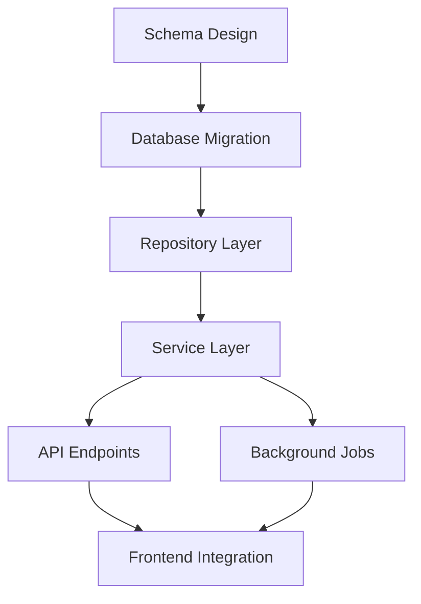

# Decomposition Patterns

Breaking down complex work into manageable, atomic tasks that minimize risk and maximize parallelization.

## Core Principles

### 1. Single Responsibility
Each task should do ONE thing. If you can use "and" to describe it, split it.

**Bad:** "Create user form and validation and API endpoint"
**Good:**
- Create user form component
- Add form validation rules
- Create API endpoint
- Connect form to API

### 2. Independence
Tasks should be as independent as possible. Minimize coupling.

**Dependency Types (Best to Worst):**
1. **None**: Tasks can run in parallel
2. **Data**: Task B needs output from Task A
3. **Structural**: Task B modifies what Task A created
4. **Temporal**: Task B must run after Task A

### 3. Verifiability
Every task must have a clear way to verify completion.

**Verification Types:**
- **Automated**: Test passes, lint clean, build succeeds
- **Manual**: Visual inspection, user flow works
- **Measurable**: Performance metric achieved

### 4. Atomicity
Tasks should complete fully or not at all. No partial states.

**Signs of non-atomic tasks:**
- "Start implementing X"
- "Continue working on Y"
- "Partially add Z"

## Decomposition Strategies

### Strategy 1: Vertical Slice

Break by user-visible functionality. Each slice is a complete feature.

```
Feature: User Authentication

Slice 1: Basic Login
├── Login form UI
├── Authentication API
├── Session management
└── Redirect after login

Slice 2: Registration
├── Registration form UI
├── User creation API
├── Email verification
└── Welcome flow

Slice 3: Password Reset
├── Reset request UI
├── Reset email sending
├── New password form
└── Password update API
```

**When to use:** Product features, MVPs, agile development

### Strategy 2: Horizontal Layer

Break by technical layer. Each layer is a complete component.

```
Feature: User Authentication

Layer 1: Data Layer
├── User model/schema
├── Session model
├── Database migrations
└── Repository methods

Layer 2: Business Logic
├── Authentication service
├── Token generation
├── Password hashing
└── Session management

Layer 3: API Layer
├── Login endpoint
├── Register endpoint
├── Logout endpoint
└── Reset password endpoints

Layer 4: UI Layer
├── Login form
├── Registration form
├── Password reset flow
└── Session display
```

**When to use:** Infrastructure work, library development, clear architectural boundaries

### Strategy 3: Risk-First

Order by risk, tackling highest risk items first.

```
Feature: Payment Integration

Risk Order:
1. [HIGH] Payment provider integration (unknown API)
2. [HIGH] Transaction security (compliance requirements)
3. [MEDIUM] Webhook handling (async complexity)
4. [MEDIUM] Error handling (many failure modes)
5. [LOW] Success flow UI (straightforward)
6. [LOW] Receipt generation (well-understood)
```

**When to use:** New technology, complex integrations, tight timelines

### Strategy 4: Outside-In

Start from user interface, work inward to implementation.

```
Feature: Search

Outside → Inside:
1. Search input component (UI)
2. Search results display (UI)
3. Search API endpoint (API)
4. Search query builder (Business)
5. Search index (Data)
6. Index population (Background)
```

**When to use:** User-facing features, clear UX requirements

### Strategy 5: Inside-Out

Start from core logic, build outward to interface.

```
Feature: Search

Inside → Outside:
1. Search algorithm (Core)
2. Index structure (Data)
3. Query parser (Business)
4. Search service (Business)
5. API endpoint (API)
6. UI components (UI)
```

**When to use:** Complex algorithms, library development

## Task Size Guidelines

### Too Small (Micro-tasks)
```
❌ "Add import statement"
❌ "Create empty file"
❌ "Add TODO comment"
```
These are implementation details, not tasks.

### Just Right (Atomic Tasks)
```
✓ "Create UserService with CRUD methods"
✓ "Add validation to registration form"
✓ "Implement password hashing utility"
✓ "Create user list component with pagination"
```
Each is a coherent unit of work.

### Too Large (Epic Tasks)
```
❌ "Implement authentication system"
❌ "Build the frontend"
❌ "Add database support"
```
These need further decomposition.

### Size Heuristics
- **Lines of Code**: 50-200 lines changed
- **Time**: 1-4 hours of focused work
- **Files**: 1-5 files modified
- **Tests**: 3-10 test cases

## Dependency Management

### Dependency Graph Example



### Identifying Critical Path

The critical path is the longest sequence of dependent tasks.

```
Critical Path: A → B → C → D → E → G (6 steps)
Parallel Path:  F (can start after D)
```

### Parallelization Opportunities

Look for tasks that:
- Share same dependency but don't depend on each other
- Can be worked on by different agents/people
- Have isolated scope

```
After "Repository Layer" completes:
├── [PARALLEL] Service method 1
├── [PARALLEL] Service method 2
└── [PARALLEL] Service method 3
```

## Decomposition Templates

### Feature Template
```markdown
## Feature: [Name]

### Prerequisites
- [ ] [What must exist first]

### Tasks (Dependency Order)

#### Phase 1: Foundation
- [ ] Task 1.1: [Description]
  - Depends: None
  - Verify: [How to verify]
- [ ] Task 1.2: [Description]
  - Depends: None
  - Verify: [How to verify]

#### Phase 2: Core
- [ ] Task 2.1: [Description]
  - Depends: 1.1
  - Verify: [How to verify]
- [ ] Task 2.2: [Description]
  - Depends: 1.1, 1.2
  - Verify: [How to verify]

#### Phase 3: Integration
- [ ] Task 3.1: [Description]
  - Depends: 2.1, 2.2
  - Verify: [How to verify]

### Parallelization
- 1.1 and 1.2 can run parallel
- 2.1 and 2.2 can run parallel after 1.x

### Checkpoints
- After Phase 1: [What to validate]
- After Phase 2: [What to validate]
- After Phase 3: [Final validation]
```

### Bug Fix Template
```markdown
## Bug Fix: [Issue]

### Investigation
- [ ] Reproduce the bug
  - Steps: [How to reproduce]
  - Verify: Bug consistently reproducible

- [ ] Identify root cause
  - Verify: Root cause documented

### Fix
- [ ] Implement fix
  - Files: [What to change]
  - Verify: Bug no longer reproducible

- [ ] Add regression test
  - Verify: Test fails without fix, passes with fix

### Validation
- [ ] Run full test suite
  - Verify: No regressions

- [ ] Manual testing
  - Verify: Related functionality works
```

### Refactoring Template
```markdown
## Refactoring: [Target]

### Preparation
- [ ] Add/verify test coverage
  - Current coverage: [X%]
  - Target coverage: [Y%]
  - Verify: All critical paths covered

### Refactoring Steps
- [ ] Step 1: [Small change]
  - Verify: Tests still pass

- [ ] Step 2: [Small change]
  - Verify: Tests still pass

- [ ] Step 3: [Small change]
  - Verify: Tests still pass

### Cleanup
- [ ] Remove dead code
  - Verify: No unused code

- [ ] Update documentation
  - Verify: Docs reflect changes
```

## Common Decomposition Mistakes

### Mistake 1: Implicit Dependencies
```
❌ Tasks look independent but have hidden coupling
```
**Fix:** Explicitly list all dependencies including data, state, and configuration

### Mistake 2: Premature Parallelization
```
❌ Planning parallel work that ends up having conflicts
```
**Fix:** Verify true independence before parallelizing

### Mistake 3: Missing Verification
```
❌ "Implement X" without how to verify
```
**Fix:** Every task needs explicit verification criteria

### Mistake 4: State Bleeding
```
❌ Task A leaves system in state that breaks Task B
```
**Fix:** Each task should leave system in clean, stable state

### Mistake 5: Scope Creep
```
❌ Task grows during implementation
```
**Fix:** If new work discovered, create new task

## Task Verification Checklist

For each task, verify:
- [ ] Single clear objective
- [ ] No "and" in description (or consciously grouped)
- [ ] Dependencies explicitly listed
- [ ] Verification method defined
- [ ] Reasonable scope (can complete in one session)
- [ ] Leaves system in stable state
- [ ] Can be tested independently
